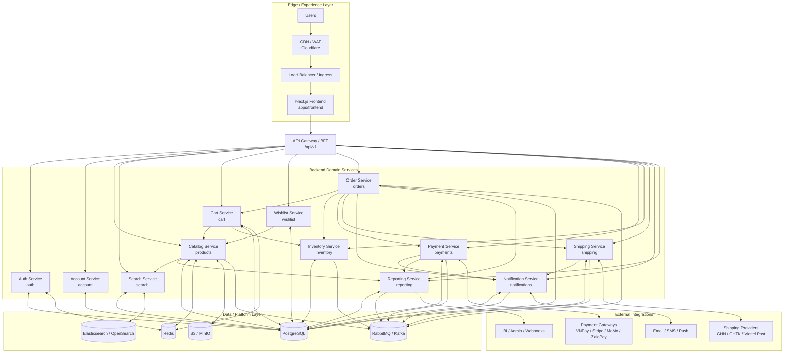
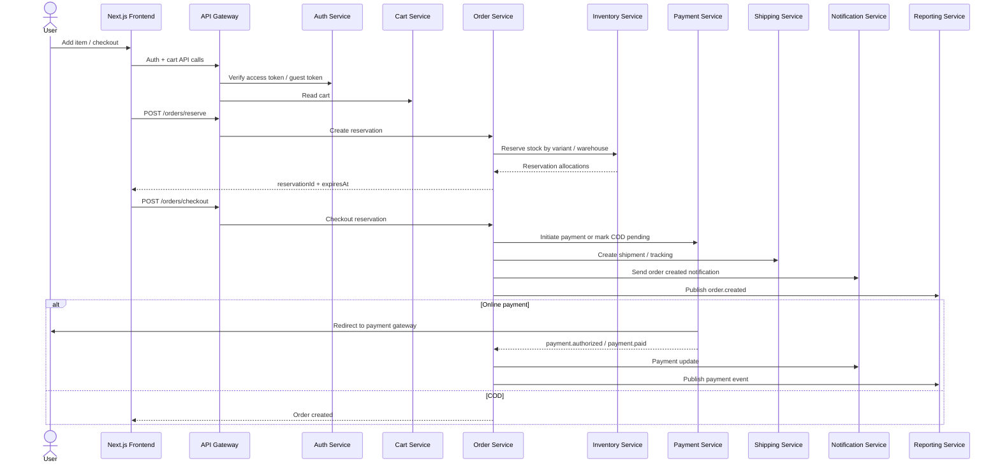

# Architecture Document

Tai lieu nay mo ta kien truc microservices muc tieu cho du an `BanHang`, dong thoi chi ra cach no map voi code hien tai trong repo.

## Current State

Repo hien tai dang chay theo mo hinh `NestJS modular monolith`:

- Frontend: `apps/frontend` (Next.js)
- Backend: `apps/backend` (1 NestJS app, nhieu domain module)
- Database: PostgreSQL qua Prisma
- Search/Cache/Event bus moi o muc logical architecture, chua tach thanh he thong production doc lap day du

## Module To Service Mapping

| Logical service | Current module |
|:--|:--|
| Auth Service | `auth` |
| Account Service | `account` |
| Catalog Service | `products` |
| Search Service | `search` |
| Cart Service | `cart` |
| Wishlist Service | `wishlist` |
| Order Service | `orders` |
| Payment Service | `payments` |
| Inventory Service | `inventory` |
| Shipping Service | `shipping` |
| Notification Service | `notifications` |
| Reporting Service | `reporting` |

## Microservices Architecture

## Checkout Event Flow

## Recommended Deployment View

- `Frontend`: Next.js app behind CDN + Load Balancer
- `Gateway`: API gateway or BFF layer for auth, rate limit, routing, aggregation
- `Core services`: Auth, Catalog, Cart, Order, Payment, Inventory, Shipping, Notification, Reporting
- `Support services`: Search, Account, Wishlist
- `Data`: PostgreSQL as source of truth, Redis for session/cache/rate-limit, Elasticsearch for search, object storage for media
- `Async backbone`: RabbitMQ or Kafka for domain events such as `product.updated`, `order.created`, `payment.paid`, `shipment.updated`

## Important Note For This Repo

Code hien tai chua deploy theo microservices that su. No dang la `modular monolith` de tang toc do phat trien:

- 1 backend app NestJS
- 1 PostgreSQL
- module boundaries da du roi de tach service sau nay
- search / cache / queue / provider integrations moi o muc `target architecture` hoac `thin integration`

Noi cach khac: so do tren la `kien truc muc tieu hop ly nhat` cho du an nay, duoc suy ra tu runbook va current module structure.
