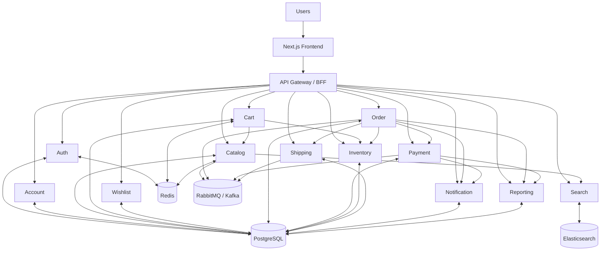

# Web Bán Hàng - Kế Hoạch Dự Án Chi Tiết

> Thiết kế và triển khai một nền tảng bán hàng trực tuyến đầy đủ chức năng (catalog, giỏ hàng, thanh toán, quản trị, báo cáo), tối ưu cho trải nghiệm mobile-first và SEO, hỗ trợ đa ngôn ngữ, đa tiền tệ, và tích hợp hệ sinh thái (CRM, kho, vận chuyển, ví/PG).

---

## Mục lục

1. [Mục tiêu dự án](#1-mục-tiêu-dự-án)
2. [Nghiên cứu & Lập kế hoạch](#2-nghiên-cứu--lập-kế-hoạch)
3. [Kiến trúc hệ thống tổng quan](#3-kiến-trúc-hệ-thống-tổng-quan)
4. [Frontend - Chi tiết chức năng](#4-frontend---chi-tiết-chức-năng)
5. [Backend - Chi tiết chức năng](#5-backend---chi-tiết-chức-năng)
6. [Cơ sở dữ liệu & Xử lý dữ liệu](#6-cơ-sở-dữ-liệu--xử-lý-dữ-liệu)
7. [Bảo mật & Tuân thủ](#7-bảo-mật--tuân-thủ)
8. [Triển khai & Vận hành](#8-triển-khai--vận-hành)
9. [Kiểm thử & Nghiệm thu](#9-kiểm-thử--nghiệm-thu)
10. [Kết quả giao hàng](#10-kết-quả-giao-hàng)
11. [Timeline & Phân chia Sprint](#11-timeline--phân-chia-sprint)
12. [Ước tính nhân sự & Chi phí](#12-ước-tính-nhân-sự--chi-phí)

---

## 1. Mục tiêu dự án

### 1.1 Mục tiêu kinh doanh
- Tạo nền tảng bán hàng trực tuyến có khả năng mở rộng phục vụ từ **1.000 đến 1.000.000+ người dùng**
- Tối ưu tỉ lệ chuyển đổi (Conversion Rate) thông qua **A/B testing** liên tục
- Hệ thống quản lý đơn hàng chuẩn **4 bước**: Tạo → Xác nhận → Giao hàng → Hoàn thành
- Hỗ trợ mô hình bán hàng **B2C** và **B2B** (marketplace mở rộng)
- Tích hợp hệ sinh thái: CRM, kho, vận chuyển, ví điện tử, cổng thanh toán

### 1.2 Mục tiêu kỹ thuật
- Thời gian phản hồi trang danh mục **< 200ms** (P95)
- Thời gian tải trang đầu tiên (FCP) **< 1.5s** trên 3G
- Largest Contentful Paint (LCP) **< 2.5s**
- Cumulative Layout Shift (CLS) **< 0.1**
- Uptime **99.9%** (downtime tối đa ~8.7 giờ/năm)
- Chịu tải **1.000 người dùng đồng thời** (concurrent users)
- Hỗ trợ **đa ngôn ngữ** (i18n): Tiếng Việt, Tiếng Anh, Tiếng Nhật, Tiếng Trung
- Hỗ trợ **đa tiền tệ**: VND, USD, JPY, EUR

### 1.3 KPI theo dõi
| KPI | Mô tả | Mục tiêu |
|:----|:-------|:---------|
| CR (Conversion Rate) | Tỉ lệ chuyển đổi từ truy cập → đơn hàng | > 3% |
| AOV (Average Order Value) | Giá trị trung bình mỗi đơn hàng | Tăng 15% sau 6 tháng |
| LTV (Lifetime Value) | Giá trị khách hàng trọn đời | Tăng 20% sau 1 năm |
| Cart Abandonment Rate | Tỉ lệ bỏ giỏ hàng | < 65% |
| Page Load Time | Thời gian tải trang | < 2s |
| Bounce Rate | Tỉ lệ thoát trang | < 40% |
| Customer Satisfaction (CSAT) | Mức độ hài lòng khách hàng | > 4.5/5 |
| Return Rate | Tỉ lệ trả hàng | < 5% |

---

## 2. Nghiên cứu & Lập kế hoạch

### 2.1 Phân tích cạnh tranh (3 đối thủ chính)

| Tiêu chí | Đối thủ A (Shopee) | Đối thủ B (Tiki) | Đối thủ C (Lazada) | Sản phẩm của ta |
|:----------|:-------------------|:-----------------|:-------------------|:----------------|
| UX/UI | Phức tạp, nhiều popup | Sạch sẽ, đơn giản | Trung bình | Tối giản, cá nhân hóa |
| Tốc độ tải trang | 3-4s | 2-3s | 3-5s | < 2s |
| Thanh toán | Ví ShopeePay, COD, thẻ | Ví TikiNOW, thẻ, COD | Ví, thẻ, COD | Tất cả + crypto |
| SEO | Tốt | Rất tốt | Trung bình | Xuất sắc (SSR/SSG) |
| Mobile Experience | App native | App native | App native | PWA + App native |
| Đa ngôn ngữ | Có | Không | Có | Có (4 ngôn ngữ+) |

### 2.2 User Journey - Phác thảo

#### Guest User (Khách vãng lai)
```
Trang chủ → Duyệt danh mục → Tìm kiếm/Lọc sản phẩm → Xem chi tiết sản phẩm
→ Thêm vào giỏ → Xem giỏ hàng → Checkout (yêu cầu đăng ký/đăng nhập hoặc checkout as guest)
→ Nhập thông tin giao hàng → Chọn phương thức thanh toán → Xác nhận đơn hàng
→ Nhận email xác nhận → Theo dõi đơn hàng qua link
```

#### Logged-in User (Khách đã đăng nhập)
```
Đăng nhập → Dashboard cá nhân → Xem gợi ý sản phẩm (AI-based)
→ Duyệt/Tìm kiếm → Thêm vào giỏ/Wishlist → Checkout nhanh (thông tin đã lưu)
→ Áp dụng mã giảm giá/điểm thưởng → Thanh toán 1-click → Theo dõi đơn hàng real-time
→ Nhận thông báo push/email → Đánh giá sản phẩm → Tích điểm loyalty
```

#### Admin User (Quản trị viên)
```
Đăng nhập admin → Dashboard tổng quan (doanh thu, đơn hàng, traffic)
→ Quản lý sản phẩm (CRUD, import/export) → Quản lý đơn hàng (xác nhận, hủy, hoàn tiền)
→ Quản lý khách hàng (CRM) → Quản lý khuyến mãi → Báo cáo & Analytics
→ Cấu hình hệ thống → Quản lý nhân viên & phân quyền
```

### 2.3 Khảo sát phương thức thanh toán phổ biến
- **Ví điện tử**: MoMo, ZaloPay, VNPay, ShopeePay
- **Thẻ quốc tế**: Visa, MasterCard, JCB, American Express
- **Thẻ nội địa**: ATM nội địa (Napas)
- **COD**: Thanh toán khi nhận hàng
- **Chuyển khoản ngân hàng**: QR Code (VietQR)
- **Trả góp**: Liên kết với ngân hàng/công ty tài chính
- **VCN (Virtual Card Number)**: Hỗ trợ thẻ ảo

### 2.4 Đánh giá pháp lý
- Luật bảo vệ quyền lợi người tiêu dùng
- Nghị định về thương mại điện tử (Nghị định 52/2013/NĐ-CP)
- Luật an ninh mạng và bảo vệ dữ liệu cá nhân
- Quy định về thuế TMĐT
- Chính sách hoàn trả theo luật định (7-30 ngày)
- GDPR (nếu phục vụ khách EU)

---

## 3. Kiến trúc hệ thống tổng quan

### 3.1 Kiến trúc tổng thể

```
                         ┌──────────────────────┐
                         │     CDN (CloudFlare)  │
                         │   Static Assets, SSL  │
                         └──────────┬───────────┘
                                    │
                         ┌──────────▼───────────┐
                         │   Load Balancer       │
                         │   (Nginx / AWS ALB)   │
                         └──────────┬───────────┘
                                    │
                    ┌───────────────┼───────────────┐
                    │               │               │
             ┌──────▼──────┐ ┌─────▼──────┐ ┌─────▼──────┐
             │  Frontend   │ │  Frontend  │ │  Frontend  │
             │  Server 1   │ │  Server 2  │ │  Server N  │
             │  (Next.js)  │ │  (Next.js) │ │  (Next.js) │
             └──────┬──────┘ └─────┬──────┘ └─────┬──────┘
                    │              │               │
                    └──────────────┼───────────────┘
                                   │
                         ┌─────────▼──────────┐
                         │    API Gateway      │
                         │  (Kong / Express)   │
                         │  Rate Limit, Auth   │
                         └─────────┬──────────┘
                                   │
          ┌────────────┬───────────┼───────────┬────────────┐
          │            │           │           │            │
   ┌──────▼──────┐ ┌──▼────┐ ┌───▼───┐ ┌────▼────┐ ┌────▼─────┐
   │  Catalog    │ │ Cart  │ │ Order │ │ Payment │ │ Auth     │
   │  Service    │ │Service│ │Service│ │ Service │ │ Service  │
   └──────┬──────┘ └──┬────┘ └───┬───┘ └────┬────┘ └────┬─────┘
          │            │         │           │            │
   ┌──────▼──────┐     │    ┌───▼───┐  ┌───▼────┐  ┌───▼─────┐
   │ Inventory   │     │    │Notify │  │Shipping│  │Reporting│
   │ Service     │     │    │Service│  │Service │  │ Service │
   └─────────────┘     │    └───────┘  └────────┘  └─────────┘
                       │
          ┌────────────┼────────────────────────────┐
          │            │                            │
   ┌──────▼──────┐ ┌──▼──────────┐  ┌─────────────▼──┐
   │ PostgreSQL  │ │ Elasticsearch│  │   Redis Cache  │
   │ (Primary)   │ │ (Search)     │  │   (Session +   │
   │             │ │              │  │    Caching)    │
   └─────────────┘ └─────────────┘  └────────────────┘
          │
   ┌──────▼──────┐
   │ Message     │
   │ Queue       │
   │ (RabbitMQ/  │
   │  Kafka)     │
   └─────────────┘
```

#### Microservices architecture




### 3.2 Lựa chọn công nghệ (Tech Stack)

| Layer | Công nghệ | Lý do chọn |
|:------|:----------|:-----------|
| **Frontend Framework** | Next.js 15 (React 19) | SSR/SSG, SEO tốt, App Router, Server Components |
| **UI Library** | Tailwind CSS + Radix UI + Shadcn/ui | Atomic design, accessible, customizable |
| **State Management** | Zustand + TanStack Query | Nhẹ, type-safe, server state management tốt |
| **Backend Runtime** | Node.js (NestJS) | TypeScript native, microservices-ready, DI built-in |
| **API Style** | REST + GraphQL (hybrid) | REST cho CRUD đơn giản, GraphQL cho query phức tạp |
| **Database** | PostgreSQL 16 | ACID, JSON support, full-text search, mature |
| **Search Engine** | Elasticsearch 8 | Full-text search, faceted filtering, auto-suggest |
| **Cache** | Redis 7 (Cluster) | Session, caching, rate limiting, pub/sub |
| **Message Queue** | RabbitMQ / Apache Kafka | Event-driven, async processing, decoupling |
| **Object Storage** | AWS S3 / MinIO | Ảnh sản phẩm, file upload, backup |
| **Container** | Docker + Kubernetes | Orchestration, auto-scaling, self-healing |
| **CI/CD** | GitHub Actions + ArgoCD | GitOps, automated deployment |
| **Monitoring** | Prometheus + Grafana + Loki | Metrics, dashboards, log aggregation |
| **APM** | Jaeger / OpenTelemetry | Distributed tracing |
| **Email** | SendGrid / AWS SES | Transactional email |
| **Real-time** | Socket.IO / Server-Sent Events | Notification, order tracking real-time |

---

## 4. Frontend - Chi tiết chức năng

### 4.1 Thiết kế hệ thống (Design System)

#### Atomic Design Structure
```
atoms/          → Button, Input, Label, Icon, Badge, Avatar, Spinner
molecules/      → SearchBar, ProductCard, PriceTag, RatingStars, FormField
organisms/      → Header, Footer, ProductGrid, CartSidebar, CheckoutForm, ReviewSection
templates/      → ProductListTemplate, ProductDetailTemplate, CheckoutTemplate
pages/          → HomePage, CategoryPage, ProductPage, CartPage, CheckoutPage
```

#### Design Tokens
- **Colors**: Primary, Secondary, Accent, Neutral, Semantic (success, warning, error, info)
- **Typography**: Font family, font sizes (12px → 48px), line heights, font weights
- **Spacing**: 4px grid system (4, 8, 12, 16, 20, 24, 32, 40, 48, 64, 80, 96)
- **Breakpoints**: Mobile (< 640px), Tablet (640-1024px), Desktop (1024-1280px), Wide (> 1280px)
- **Shadows**: sm, md, lg, xl cho depth hierarchy
- **Border Radius**: none, sm (4px), md (8px), lg (16px), full (9999px)
- **Animation**: Duration (150ms, 300ms, 500ms), easing curves

#### Accessibility (WCAG AA)
- Contrast ratio tối thiểu **4.5:1** cho text bình thường
- Tất cả interactive elements có **focus visible**
- Hỗ trợ **keyboard navigation** hoàn toàn
- **ARIA labels** cho screen readers
- Skip navigation links
- Responsive text sizing (rem-based)
- Reduced motion preferences

### 4.2 Trang chủ (Homepage)

| Chức năng | Mô tả chi tiết |
|:----------|:---------------|
| **Hero Banner Carousel** | Slider tự động (5s interval), hỗ trợ video/ảnh, lazy load, swipe trên mobile, pause on hover, dots + arrows navigation |
| **Flash Sale Countdown** | Đếm ngược real-time, hiển thị % giảm giá, số lượng còn lại, progress bar, auto-refresh khi hết hạn |
| **Danh mục nổi bật** | Grid/Carousel danh mục với icon + ảnh đại diện, hover animation, badge "Mới" / "Hot" |
| **Sản phẩm bán chạy** | Top 20 sản phẩm theo tuần/tháng, lazy load, skeleton loading, quick view on hover |
| **Sản phẩm gợi ý (AI)** | Dựa trên lịch sử duyệt web, collaborative filtering, cá nhân hóa theo user segment |
| **Sản phẩm mới** | Sắp xếp theo ngày thêm, filter theo danh mục, infinite scroll |
| **Brand showcase** | Logo carousel các thương hiệu đối tác, link đến trang brand |
| **Blog/Tin tức** | 3-4 bài viết mới nhất, ảnh thumbnail, read time estimate |
| **Newsletter signup** | Form đăng ký email, validation, double opt-in |
| **Trust badges** | Chứng chỉ bảo mật, đánh giá từ khách hàng, số đơn hàng đã xử lý |
| **Live chat widget** | Nút chat góc phải dưới, unread badge, typing indicator |
| **Recently viewed** | Lưu local storage, hiển thị carousel 10 sản phẩm gần nhất |

### 4.3 Trang danh mục sản phẩm (Product Listing Page)

#### Bộ lọc nâng cao (Advanced Filters)
- **Giá**: Range slider với input số, preset ranges (dưới 100k, 100k-500k, 500k-1tr, trên 1tr)
- **Danh mục**: Tree structure (nested categories), checkbox multi-select
- **Thương hiệu**: Checkbox list với search, hiển thị số lượng sản phẩm mỗi brand
- **Đánh giá**: Star filter (4 sao trở lên, 3 sao trở lên...)
- **Tình trạng**: Còn hàng / Hết hàng / Sắp về
- **Màu sắc**: Color swatches, multi-select
- **Kích cỡ**: Size chips (S, M, L, XL...), tùy theo loại sản phẩm
- **Chất liệu**: Checkbox list
- **Tags**: Freeship, Flash sale, Mới, Best seller
- **Khoảng ngày**: Sản phẩm mới trong 7/30/90 ngày
- **Clear all filters** button + individual filter remove (chip)

#### Sắp xếp (Sorting)
- Phổ biến nhất (dựa trên views + orders)
- Mới nhất
- Giá: Thấp → Cao
- Giá: Cao → Thấp
- Đánh giá cao nhất
- Bán chạy nhất
- Khuyến mãi nhiều nhất

#### Hiển thị
- **Grid view**: 2/3/4/5 cột (responsive)
- **List view**: Hiển thị chi tiết hơn, ảnh lớn hơn
- **Lazy loading / Infinite scroll** với option phân trang truyền thống
- **Skeleton loading** khi chờ data
- **Số lượng kết quả** và thời gian tìm kiếm
- **Breadcrumb navigation** đầy đủ
- **SEO**: Meta tags, structured data (JSON-LD), canonical URL, pagination SEO

### 4.4 Trang chi tiết sản phẩm (Product Detail Page)

| Thành phần | Chi tiết |
|:-----------|:---------|
| **Gallery ảnh** | Main image + thumbnails, zoom on hover (lens zoom), fullscreen gallery, pinch-to-zoom trên mobile, hỗ trợ video sản phẩm, 360° view |
| **Thông tin sản phẩm** | Tên, SKU, thương hiệu, rating trung bình, số lượng đánh giá, giá gốc + giá sale, % giảm giá badge |
| **Chọn biến thể (Variant)** | Color swatches với ảnh preview, size selector với size guide popup, combination matrix (color + size), hiển thị tồn kho cho từng variant |
| **Quantity selector** | +/- buttons, input trực tiếp, max = tồn kho, min = 1 |
| **Add to Cart** | Button nổi bật, animation khi thêm, mini-cart slide-in, "Đã thêm vào giỏ" toast notification |
| **Buy Now** | Chuyển thẳng sang checkout, bỏ qua giỏ hàng |
| **Wishlist** | Toggle heart icon, đăng nhập để lưu, thông báo khi giảm giá |
| **So sánh sản phẩm** | Thêm vào bảng so sánh (tối đa 4 sản phẩm), sticky compare bar |
| **Share** | Facebook, Zalo, Messenger, Copy link, QR code |
| **Mô tả sản phẩm** | Rich text, ảnh trong mô tả, collapsible sections, tab layout |
| **Thông số kỹ thuật** | Bảng key-value, so sánh với sản phẩm tương tự |
| **Đánh giá & Review** | Star rating + text review, ảnh/video từ khách hàng, filter theo star, sort by helpful/recent, admin reply, verified purchase badge |
| **Q&A Section** | Khách hàng đặt câu hỏi, admin/seller trả lời, upvote, search Q&A |
| **Sản phẩm liên quan** | AI-based recommendation, "Thường mua cùng", "Xem thêm từ brand này" |
| **Lịch sử giá** | Biểu đồ giá 30/60/90 ngày, price alert khi giảm |
| **Chính sách** | Đổi trả, bảo hành, vận chuyển (collapsible) |
| **Schema.org markup** | Product, Offer, AggregateRating, Review (SEO) |
| **Sticky Add-to-Cart** | Hiển thị khi scroll xuống, compact version với giá + nút thêm giỏ |

### 4.5 Giỏ hàng (Shopping Cart)

#### Cart Sidebar (Mini Cart)
- Slide-in từ phải khi thêm sản phẩm
- Thumbnail, tên, variant, giá, số lượng
- Quick quantity update (+/-)
- Remove item (with undo toast)
- Subtotal
- "Xem giỏ hàng" + "Thanh toán" buttons
- "Tiếp tục mua sắm" link

#### Cart Page (Full Page)
- Danh sách sản phẩm đầy đủ với ảnh lớn
- Cập nhật số lượng real-time (debounced API call)
- Xóa sản phẩm (xác nhận + undo)
- "Lưu cho sau" (move to wishlist)
- **Mã giảm giá**: Input + Apply, hiển thị danh sách mã có thể dùng, auto-suggest
- **Ước tính phí vận chuyển**: Nhập mã vùng/thành phố
- **Tóm tắt đơn hàng**: Subtotal, giảm giá, phí ship, thuế (nếu có), tổng cộng
- **Sản phẩm gợi ý**: Cross-sell dựa trên giỏ hàng hiện tại
- **Thông báo**: Sản phẩm hết hàng/sắp hết, giá thay đổi, item saved từ phiên trước
- **Cart persistence**: Lưu giỏ hàng server-side cho logged-in user, merge khi đăng nhập

### 4.6 Checkout (Thanh toán)

#### Multi-step Checkout Flow
```
Bước 1: Thông tin giao hàng
  → Địa chỉ đã lưu (select) hoặc nhập mới
  → Tên, SĐT, Email
  → Tỉnh/Thành → Quận/Huyện → Phường/Xã → Địa chỉ cụ thể
  → Ghi chú cho người giao hàng
  → Checkbox "Lưu địa chỉ này"

Bước 2: Phương thức vận chuyển
  → Giao hàng tiêu chuẩn (3-5 ngày) - phí X đồng
  → Giao hàng nhanh (1-2 ngày) - phí Y đồng
  → Giao hàng hỏa tốc (trong ngày) - phí Z đồng
  → Nhận tại cửa hàng (free)
  → Estimated delivery date cho mỗi option

Bước 3: Phương thức thanh toán
  → COD (Thanh toán khi nhận hàng)
  → Thẻ tín dụng/ghi nợ (Visa, MasterCard, JCB)
  → Thẻ ATM nội địa (Napas)
  → Ví điện tử (MoMo, ZaloPay, VNPay)
  → QR Code (VietQR)
  → Chuyển khoản ngân hàng
  → Trả góp 0% (qua ngân hàng đối tác)
  → Ví điểm thưởng (loyalty points)

Bước 4: Xác nhận đơn hàng
  → Review tất cả thông tin
  → Áp dụng mã giảm giá cuối cùng
  → Đồng ý điều khoản
  → Đặt hàng (Place Order)
  → Loading state → Success page / Payment redirect
```

#### Checkout Features
- **Guest checkout**: Cho phép mua không cần đăng ký
- **Express checkout**: 1-click cho khách hàng đã lưu thông tin
- **Auto-save**: Lưu tiến trình checkout (quay lại không mất data)
- **Address autocomplete**: Tích hợp Google Places API
- **Real-time validation**: Validate ngay khi blur field
- **Order summary sticky sidebar**: Luôn hiển thị tóm tắt bên phải
- **Trust signals**: SSL badge, secure payment icons, money-back guarantee

### 4.7 Tài khoản khách hàng (Customer Account)

#### Dashboard
- Tổng quan: Số đơn hàng, điểm loyalty, wishlist count
- Đơn hàng gần đây (5 đơn mới nhất)
- Thông báo chưa đọc
- Gợi ý sản phẩm cá nhân hóa

#### Quản lý đơn hàng
- Danh sách đơn hàng với filter (trạng thái, ngày, giá)
- Chi tiết đơn hàng: Timeline tracking real-time
- Hủy đơn hàng (nếu chưa xử lý)
- Yêu cầu đổi/trả hàng
- Tải hóa đơn PDF
- Mua lại (Re-order) 1 click
- Đánh giá sản phẩm đã mua

#### Sổ địa chỉ (Address Book)
- CRUD địa chỉ (tối đa 10)
- Đặt địa chỉ mặc định
- Label: Nhà riêng, Công ty, Khác

#### Thông tin cá nhân
- Cập nhật tên, email, SĐT, ngày sinh, giới tính
- Đổi mật khẩu
- Xóa tài khoản (GDPR compliance)
- Download dữ liệu cá nhân (GDPR)

#### Phương thức thanh toán đã lưu
- Danh sách thẻ (masked card number)
- Thêm/Xóa thẻ
- Đặt thẻ mặc định

#### Wishlist
- Danh sách sản phẩm yêu thích
- Thông báo khi giảm giá / còn hàng
- Chia sẻ wishlist
- Move to cart

#### Loyalty Program
- Điểm tích lũy và lịch sử
- Hạng thành viên (Bronze, Silver, Gold, Platinum)
- Đổi điểm lấy voucher
- Ưu đãi theo hạng

#### Referral Program
- Link giới thiệu unique
- Tracking số người đăng ký qua link
- Nhận thưởng khi bạn bè mua hàng

### 4.8 Tìm kiếm (Search)

| Tính năng | Chi tiết |
|:----------|:---------|
| **Instant search** | Kết quả real-time khi gõ (debounce 300ms), highlight matched text |
| **Autocomplete** | Gợi ý từ khóa, sản phẩm, danh mục, thương hiệu |
| **Search suggestions** | "Bạn có ý tìm...", spelling correction |
| **Recent searches** | Lưu local, xóa từng item hoặc xóa hết |
| **Trending searches** | Từ khóa phổ biến hiện tại |
| **Voice search** | Web Speech API, mobile-friendly |
| **Image search** | Upload ảnh tìm sản phẩm tương tự (AI visual search) |
| **Faceted search** | Filter kết quả theo danh mục, giá, brand... |
| **Search analytics** | Track zero-result queries, popular queries |
| **Synonyms** | "điện thoại" = "smartphone" = "phone" |
| **Elasticsearch integration** | Fuzzy matching, n-gram, Vietnamese tokenizer |

### 4.9 Thông báo (Notifications)

- **Push notifications** (Web Push API): Đơn hàng cập nhật, flash sale, sản phẩm back in stock
- **In-app notifications**: Bell icon với badge count, dropdown list, mark as read
- **Email notifications**: Xác nhận đơn hàng, shipping update, review reminder, abandoned cart
- **SMS notifications**: OTP, đơn hàng quan trọng
- **Notification preferences**: Cho phép user tùy chỉnh loại thông báo nhận

### 4.10 Chức năng khác

| Chức năng | Chi tiết |
|:----------|:---------|
| **Dynamic Promotions** | Banner khuyến mãi động, countdown timer, popup giảm giá lần đầu, exit-intent popup |
| **Product Reviews** | Star rating (1-5), text review, upload ảnh/video, helpful vote, verified badge, admin reply |
| **Wishlist** | Heart icon toggle, list management, share, notify on price drop |
| **Compare Products** | Side-by-side comparison table, tối đa 4 sản phẩm, highlight differences |
| **Store Locator** | Bản đồ Google Maps, tìm cửa hàng gần nhất, giờ mở cửa, đặt lịch |
| **Blog/Content** | CMS tích hợp, SEO-optimized articles, liên kết sản phẩm trong bài viết |
| **Multi-language** | i18n với next-intl, switch ngôn ngữ, RTL support sẵn sàng |
| **Multi-currency** | Tự động detect theo IP/preference, exchange rate cập nhật daily |
| **Dark Mode** | Toggle system/light/dark, persist preference |
| **PWA** | Installable, offline catalog browsing, background sync |

---

## 5. Backend - Chi tiết chức năng

### 5.1 Kiến trúc Microservices

> Tham chiếu thêm sơ đồ Mermaid và mapping `module -> service` tại [architecture.md](./architecture.md).  
> Trong source code hiện tại, các service này đang được triển khai dưới dạng **domain modules** bên trong một backend NestJS duy nhất, đủ boundary để tách thành microservices khi cần.

#### Service 1: Catalog Service
```
Chức năng:
  - CRUD sản phẩm (product, variant, SKU)
  - Quản lý danh mục (nested tree structure)
  - Quản lý thương hiệu
  - Quản lý thuộc tính sản phẩm (dynamic attributes)
  - Upload & quản lý media (ảnh, video)
  - Import/Export sản phẩm (CSV, Excel)
  - Quản lý SEO metadata per product
  - Product versioning (lịch sử thay đổi)
  - Bulk operations (update giá hàng loạt, thay đổi trạng thái)

API Endpoints:
  GET    /api/v1/products              → List products (paginated, filtered)
  GET    /api/v1/products/:slug        → Product detail
  POST   /api/v1/products              → Create product (admin)
  PUT    /api/v1/products/:id          → Update product (admin)
  DELETE /api/v1/products/:id          → Soft delete product (admin)
  POST   /api/v1/products/import       → Bulk import
  GET    /api/v1/products/export       → Export CSV/Excel
  GET    /api/v1/categories            → Category tree
  POST   /api/v1/categories            → Create category (admin)
  GET    /api/v1/brands                → List brands
  POST   /api/v1/products/:id/media    → Upload media

Database: PostgreSQL (products, categories, brands, product_attributes, media)
Cache: Redis (product detail cache, category tree cache - TTL 5 min)
Search: Elasticsearch (full-text, faceted filtering, autocomplete)
```

#### Service 2: Cart Service
```
Chức năng:
  - Thêm/Xóa/Cập nhật item trong giỏ
  - Merge cart (anonymous → authenticated)
  - Cart validation (kiểm tra tồn kho, giá, trạng thái)
  - Coupon/Discount application
  - Cart expiration (auto-clear sau 30 ngày)
  - Save for later
  - Cart sharing (tạo link chia sẻ giỏ hàng)

API Endpoints:
  GET    /api/v1/cart                  → Get current cart
  POST   /api/v1/cart/items            → Add item
  PUT    /api/v1/cart/items/:id        → Update quantity
  DELETE /api/v1/cart/items/:id        → Remove item
  POST   /api/v1/cart/merge            → Merge anonymous cart
  POST   /api/v1/cart/coupon           → Apply coupon
  DELETE /api/v1/cart/coupon           → Remove coupon
  POST   /api/v1/cart/save-for-later   → Move item to wishlist

Storage: Redis (active carts) + PostgreSQL (persistent carts)
```

#### Service 3: Order Service
```
Chức năng:
  - Tạo đơn hàng từ cart
  - Order state machine:
      PENDING → CONFIRMED → PROCESSING → SHIPPED → DELIVERED → COMPLETED
                    ↓                        ↓          ↓
                CANCELLED               RETURNED    REFUNDED
  - Quản lý đơn hàng (admin)
  - Tính phí vận chuyển
  - Tạo hóa đơn PDF
  - Order splitting (nhiều warehouse)
  - Partial fulfillment
  - Order notes (internal + customer-facing)
  - Order timeline/history

API Endpoints:
  POST   /api/v1/orders                → Create order
  GET    /api/v1/orders                → List orders (user)
  GET    /api/v1/orders/:id            → Order detail
  PUT    /api/v1/orders/:id/status     → Update status (admin)
  POST   /api/v1/orders/:id/cancel     → Cancel order
  POST   /api/v1/orders/:id/return     → Request return
  GET    /api/v1/orders/:id/invoice    → Download invoice PDF
  GET    /api/v1/orders/:id/tracking   → Tracking info

Database: PostgreSQL (orders, order_items, order_status_history)
Events: OrderCreated, OrderConfirmed, OrderShipped, OrderDelivered, OrderCancelled
```

#### Service 4: Payment Service
```
Chức năng:
  - Xử lý thanh toán qua nhiều gateway
  - Payment state machine:
      INITIATED → PROCESSING → SUCCESS / FAILED
                                  ↓
                              REFUNDED (full/partial)
  - Webhook handlers cho mỗi payment gateway
  - Retry logic cho failed payments
  - Refund processing
  - Payment reconciliation (đối soát)
  - Installment payment handling
  - Saved payment methods (tokenized)

Tích hợp Payment Gateways:
  - VNPay (thẻ nội địa, QR, ví)
  - MoMo (ví điện tử)
  - ZaloPay (ví điện tử)
  - Stripe (thẻ quốc tế)
  - PayPal (quốc tế)
  - COD handler

API Endpoints:
  POST   /api/v1/payments              → Initiate payment
  GET    /api/v1/payments/:id          → Payment status
  POST   /api/v1/payments/:id/refund   → Process refund
  POST   /api/v1/payments/webhook/:gateway → Webhook receiver
  GET    /api/v1/payments/methods       → Available payment methods

Security: PCI-DSS compliant, no raw card data stored, tokenization
```

#### Service 5: Auth Service
```
Chức năng:
  - Đăng ký (email, phone, social)
  - Đăng nhập (email + password, OTP, social login)
  - JWT access token + refresh token rotation
  - OAuth2 Social Login: Google, Facebook, Apple, Zalo
  - Two-Factor Authentication (2FA): TOTP, SMS
  - Password reset flow (email link, OTP)
  - Email verification
  - Session management (list active sessions, revoke)
  - Role-Based Access Control (RBAC)
  - API key management (cho integration)
  - Account lockout after N failed attempts
  - IP-based suspicious login detection

API Endpoints:
  POST   /api/v1/auth/register          → Register
  POST   /api/v1/auth/login             → Login
  POST   /api/v1/auth/logout            → Logout
  POST   /api/v1/auth/refresh           → Refresh token
  POST   /api/v1/auth/forgot-password   → Request password reset
  POST   /api/v1/auth/reset-password    → Reset password
  POST   /api/v1/auth/verify-email      → Verify email
  POST   /api/v1/auth/social/:provider  → Social login
  POST   /api/v1/auth/2fa/enable        → Enable 2FA
  POST   /api/v1/auth/2fa/verify        → Verify 2FA code
  GET    /api/v1/auth/sessions          → List active sessions
  DELETE /api/v1/auth/sessions/:id      → Revoke session

Roles: SUPER_ADMIN, ADMIN, MANAGER, STAFF, CUSTOMER, GUEST
Permissions: Granular per-resource (products.create, orders.read, etc.)
```

#### Service 6: Inventory Service
```
Chức năng:
  - Quản lý tồn kho theo warehouse + variant
  - Stock reservation (giữ hàng khi checkout)
  - Stock movement tracking (nhập, xuất, chuyển kho, điều chỉnh)
  - Low stock alerts
  - Reorder point automation
  - Inventory sync với hệ thống kho bên ngoài
  - Stock forecast (dựa trên lịch sử bán hàng)
  - Batch/Lot tracking
  - Multi-warehouse support

API Endpoints:
  GET    /api/v1/inventory/:sku             → Check stock
  POST   /api/v1/inventory/reserve          → Reserve stock
  POST   /api/v1/inventory/release          → Release reservation
  POST   /api/v1/inventory/adjust           → Manual adjustment
  GET    /api/v1/inventory/movements        → Stock movement history
  GET    /api/v1/inventory/low-stock        → Low stock report
  POST   /api/v1/inventory/transfer         → Transfer between warehouses

Database: PostgreSQL (inventory, stock_movements, warehouses, reservations)
Events: StockReserved, StockReleased, LowStockAlert, StockAdjusted
```

#### Service 7: Notification Service
```
Chức năng:
  - Email notifications (transactional + marketing)
  - SMS notifications (OTP, order updates)
  - Web Push notifications
  - In-app notifications (bell icon)
  - Notification templates (Handlebars/Mustache)
  - Scheduled notifications (cron-based)
  - Notification preferences per user
  - Batch sending (marketing campaigns)
  - Delivery tracking (opened, clicked)
  - Unsubscribe handling

Channels:
  - Email: SendGrid / AWS SES (with templates)
  - SMS: Twilio / Vonage / local provider
  - Push: Firebase Cloud Messaging (FCM) / Web Push
  - In-app: WebSocket / SSE

Events Consumed:
  - OrderCreated → Email xác nhận + SMS
  - OrderShipped → Email + Push + SMS
  - OrderDelivered → Email + Push (request review)
  - CartAbandoned → Email reminder (after 1h, 24h, 72h)
  - PriceDropped → Push + Email (wishlist items)
  - BackInStock → Push + Email
  - WelcomeNewUser → Email series (drip campaign)
```

#### Service 8: Reporting Service
```
Chức năng:
  - Dashboard tổng quan (real-time)
  - Báo cáo doanh thu (theo ngày/tuần/tháng/năm)
  - Báo cáo sản phẩm bán chạy
  - Báo cáo khách hàng (new vs returning, demographics)
  - Báo cáo tồn kho
  - Báo cáo vận chuyển
  - Báo cáo thanh toán & đối soát
  - Báo cáo conversion funnel
  - Báo cáo coupon/promotion performance
  - Export reports (PDF, Excel, CSV)
  - Scheduled reports (email tự động)
  - Custom report builder

Metrics:
  - GMV (Gross Merchandise Value)
  - Revenue, Profit margin
  - Orders per day/week/month
  - Average order value (AOV)
  - Customer acquisition cost (CAC)
  - Customer lifetime value (CLV)
  - Cart abandonment rate
  - Return rate
  - Top products, top categories
  - Geographic distribution
  - Traffic sources
  - Conversion funnel (visit → cart → checkout → purchase)

Tech: 
  - OLAP: PostgreSQL (materialized views) hoặc ClickHouse
  - Visualization: Custom charts (Chart.js / Recharts)
  - Caching: Redis (dashboard metrics - TTL 5 min)
```

#### Service 9: Shipping Service
```
Chức năng:
  - Tích hợp đối tác vận chuyển (GHN, GHTK, J&T, Viettel Post, Grab Express)
  - Tính phí vận chuyển real-time
  - Tạo vận đơn tự động
  - In nhãn vận chuyển
  - Tracking shipment real-time
  - Shipping zone management
  - Free shipping rules (theo giá trị đơn, theo khu vực)
  - Estimated delivery date calculation
  - Return shipping label generation

API Endpoints:
  POST   /api/v1/shipping/calculate      → Calculate shipping fee
  POST   /api/v1/shipping/create         → Create shipment
  GET    /api/v1/shipping/:id/tracking   → Track shipment
  POST   /api/v1/shipping/:id/label      → Generate label
  GET    /api/v1/shipping/zones          → List shipping zones
```

### 5.2 Admin Panel (Trang quản trị)

#### Dashboard
- **Real-time metrics**: Doanh thu hôm nay, đơn hàng mới, khách truy cập, conversion rate
- **Charts**: Line chart doanh thu 30 ngày, pie chart nguồn traffic, bar chart top sản phẩm
- **Quick actions**: Xác nhận đơn hàng pending, xử lý low stock
- **Alerts**: Đơn hàng chờ xử lý, sản phẩm sắp hết, review chờ duyệt

#### Quản lý sản phẩm (Product Management)
- CRUD sản phẩm với rich text editor (TipTap/ProseMirror)
- Drag & drop image upload, image crop & resize
- Variant matrix generator (tự tạo combinations)
- SEO fields: meta title, meta description, URL slug
- Product status: Draft, Active, Archived
- Scheduled publishing (đặt lịch hiển thị)
- Product cloning (duplicate nhanh)
- Import/Export CSV/Excel (template download)
- Bulk edit: giá, trạng thái, category

#### Quản lý đơn hàng (Order Management)
- Danh sách đơn hàng với filter/sort/search
- Chi tiết đơn hàng: timeline, items, customer info, payment info
- Actions: Confirm, Cancel, Refund (full/partial), Add note
- Bulk actions: Confirm multiple, export, print labels
- Order fraud detection alerts

#### Quản lý khách hàng (CRM)
- Danh sách khách hàng với search, filter
- Customer profile: thông tin, lịch sử mua hàng, total spent, loyalty tier
- Customer segments (VIP, New, At-risk, Inactive)
- Manual notes/tags
- Export customer data

#### Quản lý khuyến mãi (Promotion Management)
- **Coupon codes**: Fixed amount, percentage, free shipping
- **Auto-discount rules**: Buy X get Y, bundle discount, tiered discount
- **Flash sales**: Scheduled, limited quantity, countdown
- **Loyalty points**: Earn & burn rules
- **Gift cards**: Generate, activate, check balance
- Promotion analytics: usage count, revenue impact

#### Content Management (CMS)
- Quản lý trang tĩnh (About, Contact, FAQ, Policy)
- Quản lý blog posts
- Banner management (homepage, category page)
- SEO management: sitemap, robots.txt, redirects

#### Cấu hình hệ thống (Settings)
- Store information (name, logo, contact)
- Email templates
- Payment gateway configuration
- Shipping configuration
- Tax configuration
- Notification settings
- Maintenance mode toggle

---

## 6. Cơ sở dữ liệu & Xử lý dữ liệu

### 6.1 Entity Relationship Diagram (ER)

#### Core Entities

```
┌─────────────┐    ┌──────────────┐    ┌───────────────┐
│   users      │    │  categories  │    │   brands      │
├─────────────┤    ├──────────────┤    ├───────────────┤
│ id (PK)     │    │ id (PK)      │    │ id (PK)       │
│ email       │    │ name         │    │ name          │
│ password    │    │ slug         │    │ slug          │
│ first_name  │    │ parent_id(FK)│    │ logo_url      │
│ last_name   │    │ description  │    │ description   │
│ phone       │    │ image_url    │    │ website       │
│ avatar_url  │    │ sort_order   │    │ is_active     │
│ role        │    │ is_active    │    │ created_at    │
│ is_active   │    │ created_at   │    └───────────────┘
│ is_verified │    └──────────────┘
│ loyalty_tier│
│ loyalty_pts │         ┌───────────────────┐
│ created_at  │         │    products        │
│ updated_at  │         ├───────────────────┤
└─────────────┘         │ id (PK)           │
                        │ name              │
                        │ slug              │
                        │ description       │
                        │ category_id (FK)  │
                        │ brand_id (FK)     │
                        │ base_price        │
                        │ status            │
                        │ is_featured       │
                        │ meta_title        │
                        │ meta_description  │
                        │ avg_rating        │
                        │ total_reviews     │
                        │ total_sold        │
                        │ created_at        │
                        │ updated_at        │
                        └───────────────────┘
                                │
                    ┌───────────┴────────────┐
                    │                        │
         ┌──────────▼──────────┐  ┌─────────▼──────────┐
         │  product_variants   │  │  product_media     │
         ├────────────────────┤  ├────────────────────┤
         │ id (PK)            │  │ id (PK)            │
         │ product_id (FK)    │  │ product_id (FK)    │
         │ sku                │  │ url                │
         │ name               │  │ type (image/video) │
         │ price              │  │ sort_order         │
         │ compare_at_price   │  │ alt_text           │
         │ weight             │  │ is_primary         │
         │ dimensions         │  └────────────────────┘
         │ is_active          │
         │ created_at         │
         └────────────────────┘
                    │
         ┌──────────▼──────────┐
         │    inventory        │
         ├────────────────────┤
         │ id (PK)            │
         │ variant_id (FK)    │
         │ warehouse_id (FK)  │
         │ quantity           │
         │ reserved_qty       │
         │ reorder_point      │
         │ updated_at         │
         └────────────────────┘
```

#### Order & Payment Entities

```
┌──────────────────┐       ┌──────────────────┐
│     orders        │       │   order_items     │
├──────────────────┤       ├──────────────────┤
│ id (PK)          │───┐   │ id (PK)          │
│ user_id (FK)     │   │   │ order_id (FK)    │
│ order_number     │   └──▶│ variant_id (FK)  │
│ status           │       │ product_name     │
│ subtotal         │       │ sku              │
│ discount_amount  │       │ quantity         │
│ shipping_fee     │       │ unit_price       │
│ tax_amount       │       │ total_price      │
│ total_amount     │       │ created_at       │
│ currency         │       └──────────────────┘
│ shipping_addr_id │
│ billing_addr_id  │    ┌──────────────────────┐
│ coupon_id (FK)   │    │     payments          │
│ payment_method   │    ├──────────────────────┤
│ payment_status   │    │ id (PK)              │
│ shipping_method  │    │ order_id (FK)        │
│ notes            │    │ gateway              │
│ ip_address       │    │ transaction_id       │
│ user_agent       │    │ amount               │
│ created_at       │    │ currency             │
│ updated_at       │    │ status               │
│ confirmed_at     │    │ metadata (JSONB)     │
│ shipped_at       │    │ refund_amount        │
│ delivered_at     │    │ refunded_at          │
│ completed_at     │    │ created_at           │
│ cancelled_at     │    └──────────────────────┘
└──────────────────┘

┌──────────────────────┐    ┌──────────────────────┐
│  order_status_history │    │      addresses        │
├──────────────────────┤    ├──────────────────────┤
│ id (PK)              │    │ id (PK)              │
│ order_id (FK)        │    │ user_id (FK)         │
│ from_status          │    │ label                │
│ to_status            │    │ full_name            │
│ note                 │    │ phone                │
│ changed_by           │    │ province             │
│ created_at           │    │ district             │
│ ip_address           │    │ ward                 │
└──────────────────────┘    │ address_line         │
                            │ is_default           │
                            │ created_at           │
                            └──────────────────────┘
```

#### Supporting Entities

```
┌──────────────────┐    ┌──────────────────┐    ┌──────────────────┐
│    reviews        │    │    wishlists      │    │    coupons        │
├──────────────────┤    ├──────────────────┤    ├──────────────────┤
│ id (PK)          │    │ id (PK)          │    │ id (PK)          │
│ product_id (FK)  │    │ user_id (FK)     │    │ code             │
│ user_id (FK)     │    │ product_id (FK)  │    │ type             │
│ order_id (FK)    │    │ created_at       │    │ value            │
│ rating (1-5)     │    └──────────────────┘    │ min_order_amount │
│ title            │                            │ max_discount     │
│ content          │    ┌──────────────────┐    │ usage_limit      │
│ images (JSONB)   │    │  notifications   │    │ used_count       │
│ is_verified      │    ├──────────────────┤    │ starts_at        │
│ helpful_count    │    │ id (PK)          │    │ expires_at       │
│ admin_reply      │    │ user_id (FK)     │    │ is_active        │
│ status           │    │ type             │    │ created_at       │
│ created_at       │    │ title            │    └──────────────────┘
└──────────────────┘    │ content          │
                        │ data (JSONB)     │
                        │ is_read          │
                        │ created_at       │
                        └──────────────────┘
```

### 6.2 Database Indexes Strategy

```sql
-- Products (hot path: listing, search)
CREATE INDEX idx_products_category ON products(category_id) WHERE status = 'active';
CREATE INDEX idx_products_brand ON products(brand_id) WHERE status = 'active';
CREATE INDEX idx_products_price ON products(base_price);
CREATE INDEX idx_products_created ON products(created_at DESC);
CREATE INDEX idx_products_slug ON products(slug) WHERE status = 'active';
CREATE INDEX idx_products_featured ON products(is_featured) WHERE status = 'active';

-- Orders (hot path: user orders, admin management)
CREATE INDEX idx_orders_user ON orders(user_id, created_at DESC);
CREATE INDEX idx_orders_status ON orders(status, created_at DESC);
CREATE INDEX idx_orders_number ON orders(order_number);
CREATE INDEX idx_orders_created ON orders(created_at DESC);

-- Inventory (hot path: stock check)
CREATE INDEX idx_inventory_variant ON inventory(variant_id, warehouse_id);
CREATE INDEX idx_inventory_low_stock ON inventory(quantity) WHERE quantity <= reorder_point;

-- Reviews
CREATE INDEX idx_reviews_product ON reviews(product_id, status, created_at DESC);

-- Full-text search (PostgreSQL native)
CREATE INDEX idx_products_search ON products USING gin(to_tsvector('vietnamese', name || ' ' || description));
```

### 6.3 Xử lý dữ liệu (Data Processing)

#### ETL Pipeline (Import Catalog)
```
Source (CSV/Excel/API)
  → Validation (schema check, data type, required fields)
  → Transformation (normalize prices, map categories, resize images)
  → Deduplication (check SKU, product name)
  → Load (upsert vào PostgreSQL)
  → Index (sync to Elasticsearch)
  → Notify (report import results)

Công cụ: Node.js worker threads / Bull queue
Schedule: Manual trigger + scheduled (daily sync từ ERP)
```

#### Event Sourcing / Change Data Capture (CDC)
```
PostgreSQL WAL → Debezium → Kafka → Consumers

Use cases:
  - Sync product changes → Elasticsearch (search index)
  - Sync order events → Reporting database
  - Sync inventory changes → Cache invalidation
  - Audit log generation
  - Real-time analytics
```

#### Backup & Retention Policy
| Loại | Tần suất | Retention | Storage |
|:-----|:---------|:----------|:--------|
| Full backup (DB) | Daily 2:00 AM | 30 ngày | S3 Glacier |
| Incremental backup | Every 6 hours | 7 ngày | S3 Standard |
| WAL archiving | Continuous | 7 ngày | S3 Standard |
| Media files | Daily sync | Unlimited | S3 + CDN |
| Elasticsearch snapshot | Daily | 14 ngày | S3 |
| Redis RDB | Every 15 min | 3 ngày | S3 |
| Log files | Daily rotation | 90 ngày | S3 + Loki |

#### Disaster Recovery
- **RPO (Recovery Point Objective)**: < 1 giờ
- **RTO (Recovery Time Objective)**: < 4 giờ
- Multi-AZ database replication
- Cross-region backup
- Documented restore procedures + quarterly DR drills

---

## 7. Bảo mật & Tuân thủ

### 7.1 Application Security

| Lớp bảo mật | Chi tiết triển khai |
|:-------------|:-------------------|
| **Authentication** | Bcrypt password hashing (cost factor 12), JWT RS256, refresh token rotation, account lockout after 5 failed attempts |
| **Authorization** | RBAC + attribute-based, middleware check mỗi request, principle of least privilege |
| **Input Validation** | Zod/Joi schema validation, whitelist approach, max length limits |
| **SQL Injection** | Parameterized queries (ORM), no raw SQL from user input |
| **XSS Prevention** | CSP headers, output encoding, DOMPurify cho user-generated content |
| **CSRF Protection** | SameSite cookies, CSRF tokens cho form submissions |
| **Rate Limiting** | Per-IP + per-user, sliding window (Redis), different limits per endpoint |
| **File Upload** | Type validation (magic bytes), size limit (10MB), virus scan (ClamAV), separate storage domain |

### 7.2 Infrastructure Security

| Lớp | Chi tiết |
|:----|:---------|
| **TLS 1.3** | Enforce HTTPS everywhere, HSTS header, certificate auto-renewal (Let's Encrypt) |
| **Helmet Headers** | X-Frame-Options, X-Content-Type-Options, Referrer-Policy, Permissions-Policy |
| **WAF** | AWS WAF / Cloudflare WAF, OWASP Top 10 ruleset, custom rules for business logic |
| **DDoS Protection** | Cloudflare / AWS Shield, rate limiting at edge |
| **Network** | VPC, private subnets for DB/cache, security groups, no public DB access |
| **Secrets Management** | AWS Secrets Manager / HashiCorp Vault, no secrets in code/env files |
| **Container Security** | Non-root containers, read-only filesystem, vulnerability scanning (Trivy) |
| **Dependency Security** | Automated dependency audit (npm audit, Snyk), auto-PR for vulnerabilities |

### 7.3 PCI-DSS Compliance (cho thanh toán)
- Không lưu trữ raw card data (sử dụng tokenization)
- Payment form từ iframe/SDK của payment gateway
- Quarterly vulnerability scanning
- Annual penetration testing
- Access logging cho payment-related operations
- Network segmentation cho payment processing

### 7.4 GDPR / Data Privacy
- Cookie consent banner (opt-in)
- Privacy policy & Terms of service
- Right to access (export personal data)
- Right to erasure (delete account + data)
- Data processing agreements với third-party
- Data encryption at rest (AES-256) và in transit (TLS 1.3)
- Data retention policies (auto-delete inactive accounts after 3 years)
- Privacy impact assessment documentation

### 7.5 Logging & Monitoring Security
```
Structured logging (JSON format):
{
  "timestamp": "ISO-8601",
  "level": "info|warn|error",
  "service": "order-service",
  "traceId": "uuid",
  "userId": "uuid",
  "action": "order.create",
  "ip": "xxx.xxx.xxx.xxx",
  "userAgent": "...",
  "duration": 150,
  "status": 200
}

Sensitive data masking:
  - Email: j***@example.com
  - Phone: ****1234
  - Card: ****4242
  - Password: NEVER logged

Security event alerts:
  - Multiple failed login attempts
  - Admin action on sensitive data
  - Unusual transaction patterns
  - Rate limit exceeded
  - New device/location login
```

---

## 8. Triển khai & Vận hành

### 8.1 CI/CD Pipeline

```
Developer Push → GitHub
  │
  ▼
GitHub Actions Triggered
  │
  ├─ Stage 1: Code Quality
  │   ├─ Lint (ESLint + Prettier)
  │   ├─ Type check (TypeScript)
  │   ├─ Unit tests (Jest/Vitest)
  │   └─ Code coverage check (> 80%)
  │
  ├─ Stage 2: Build & Test
  │   ├─ Build Docker images
  │   ├─ Integration tests
  │   ├─ E2E tests (Playwright)
  │   └─ Security scan (Snyk + Trivy)
  │
  ├─ Stage 3: Deploy to Staging
  │   ├─ Push images to registry
  │   ├─ ArgoCD sync staging
  │   ├─ Run smoke tests
  │   └─ Performance test (k6)
  │
  └─ Stage 4: Deploy to Production
      ├─ Manual approval gate
      ├─ Blue/Green hoặc Canary deploy
      ├─ Health check validation
      ├─ Rollback nếu error rate > 1%
      └─ Post-deploy monitoring (30 min)
```

### 8.2 Container & Orchestration

#### Docker
```dockerfile
# Multi-stage build
FROM node:20-alpine AS builder
WORKDIR /app
COPY package*.json ./
RUN npm ci --only=production
COPY . .
RUN npm run build

FROM node:20-alpine AS runner
RUN addgroup -g 1001 -S nodejs && adduser -S nextjs -u 1001
COPY --from=builder --chown=nextjs:nodejs /app/.next ./.next
COPY --from=builder /app/node_modules ./node_modules
USER nextjs
EXPOSE 3000
CMD ["node", "server.js"]
```

#### Kubernetes Resources
```
Namespace: ecommerce-prod
  │
  ├── Deployments
  │   ├── frontend (3 replicas, HPA: 3-10)
  │   ├── catalog-service (2 replicas, HPA: 2-8)
  │   ├── cart-service (2 replicas, HPA: 2-6)
  │   ├── order-service (2 replicas, HPA: 2-8)
  │   ├── payment-service (2 replicas, HPA: 2-6)
  │   ├── auth-service (2 replicas, HPA: 2-6)
  │   ├── inventory-service (2 replicas, HPA: 2-4)
  │   ├── notification-service (2 replicas, HPA: 2-4)
  │   ├── reporting-service (1 replica, HPA: 1-3)
  │   └── shipping-service (2 replicas, HPA: 2-4)
  │
  ├── StatefulSets
  │   ├── postgresql (primary + 2 replicas)
  │   ├── elasticsearch (3 nodes)
  │   └── redis (cluster, 6 nodes)
  │
  ├── Services (ClusterIP + LoadBalancer)
  ├── Ingress (Nginx Ingress Controller)
  ├── ConfigMaps & Secrets
  ├── HorizontalPodAutoscaler
  ├── PodDisruptionBudget
  └── NetworkPolicies
```

### 8.3 Auto-scaling Strategy

| Metric | Scale Up | Scale Down | Cooldown |
|:-------|:---------|:-----------|:---------|
| CPU > 70% | +1 pod | CPU < 30% → -1 pod | 5 min |
| Memory > 80% | +1 pod | Memory < 40% → -1 pod | 5 min |
| Request rate > 1000 rps | +2 pods | < 200 rps → -1 pod | 10 min |
| Queue depth > 1000 | +1 worker | < 100 → -1 worker | 5 min |

### 8.4 Deployment Strategies

#### Blue/Green Deployment
```
1. Deploy new version → Green environment
2. Run health checks + smoke tests on Green
3. Switch load balancer traffic Blue → Green
4. Monitor for 30 minutes
5. If OK → terminate Blue
6. If Error → instant rollback: switch back to Blue
```

#### Canary Deployment (cho production)
```
1. Deploy new version → 5% traffic
2. Monitor error rate, latency, business metrics (15 min)
3. If OK → 25% traffic (15 min)
4. If OK → 50% traffic (15 min)
5. If OK → 100% traffic
6. If anomaly at any step → instant rollback to 0%
```

### 8.5 Monitoring & Alerting

#### Prometheus Metrics
- **Application**: Request rate, error rate, response time (p50, p95, p99), active connections
- **Business**: Orders/min, revenue/hour, cart abandonment, signup rate
- **Infrastructure**: CPU, memory, disk, network I/O
- **Database**: Query time, connections, replication lag, cache hit ratio

#### Grafana Dashboards
1. **Overview Dashboard**: All services health, traffic, error budget
2. **Service Dashboard**: Per-service metrics, dependencies
3. **Business Dashboard**: Revenue, orders, conversions
4. **Infrastructure Dashboard**: K8s cluster, nodes, pods
5. **Database Dashboard**: PostgreSQL, Redis, Elasticsearch metrics

#### Alert Rules (SLO/SLI)

| SLI | SLO | Alert Threshold |
|:----|:----|:----------------|
| Availability | 99.9% | < 99.5% → P1 |
| Latency (p95) | < 200ms | > 500ms → P2 |
| Error rate | < 0.1% | > 1% → P1 |
| Payment success | > 99% | < 95% → P1 |
| Search latency | < 100ms | > 300ms → P2 |

#### Alert Channels
- **P1 (Critical)**: PagerDuty → Phone call + SMS + Slack
- **P2 (Warning)**: Slack channel + Email
- **P3 (Info)**: Slack channel only

---

## 9. Kiểm thử & Nghiệm thu

### 9.1 Testing Strategy (Testing Pyramid)

```
          ╱╲
         ╱  ╲        E2E Tests (Playwright)
        ╱ 10% ╲       → Critical user flows
       ╱────────╲
      ╱          ╲    Integration Tests (Supertest + Testcontainers)
     ╱    20%     ╲    → API endpoints, DB queries, service interactions
    ╱──────────────╲
   ╱                ╲  Unit Tests (Jest/Vitest)
  ╱      70%         ╲  → Business logic, utilities, components
 ╱────────────────────╲
```

### 9.2 Chi tiết từng loại test

#### Unit Tests
- **Frontend**: React Testing Library, component rendering, user interactions, hooks
- **Backend**: Service layer logic, validation, helpers, transformers
- **Coverage target**: > 80% lines, > 70% branches
- **Convention**: 1 test file per source file, `*.test.ts` / `*.spec.ts`

#### Integration Tests
- API endpoint tests (request → response validation)
- Database operations (CRUD, transactions, constraints)
- Service-to-service communication
- Cache behavior
- Queue message processing
- Testcontainers cho PostgreSQL, Redis, Elasticsearch

#### E2E Tests (Playwright)
```
Critical User Flows:
  1. Guest browsing → Search → View product → Add to cart → Guest checkout → Payment
  2. Register → Login → Browse → Add to cart → Apply coupon → Checkout → Track order
  3. Admin login → Create product → Update inventory → Process order → Generate report
  4. User login → Write review → Add to wishlist → Use referral link
  5. Password reset flow
  6. Social login flow (mocked)
  7. Multi-language switching
  8. Mobile responsive checkout

Browsers: Chromium, Firefox, WebKit
Devices: Desktop (1920x1080), Tablet (768x1024), Mobile (375x667)
```

#### Visual Regression Tests
- Chromatic / Percy cho Storybook components
- Screenshot comparison cho critical pages
- Threshold: < 0.1% pixel diff

### 9.3 Performance Testing (Load Tests)

#### Tool: k6 / Artillery

```
Scenarios:

1. Smoke Test
   - 1 VU, 1 minute
   - Verify basic functionality

2. Load Test
   - Ramp up: 0 → 1000 VUs over 5 minutes
   - Sustain: 1000 VUs for 30 minutes
   - Ramp down: 1000 → 0 over 5 minutes

3. Stress Test
   - Ramp up to 2000 VUs
   - Find breaking point
   - Verify graceful degradation

4. Spike Test
   - 100 VUs → 2000 VUs instantly
   - Sustain 5 minutes
   - Drop back to 100 VUs

5. Soak Test
   - 500 VUs for 4 hours
   - Check memory leaks, connection pool exhaustion

Target Metrics:
  - Response time p95 < 200ms (catalog pages)
  - Response time p95 < 500ms (checkout)
  - Error rate < 0.1%
  - Throughput > 500 requests/second
  - 1000 concurrent users supported
```

### 9.4 Security Testing

| Loại | Công cụ | Tần suất |
|:-----|:--------|:---------|
| SAST (Static Analysis) | SonarQube, ESLint security plugin | Every commit |
| DAST (Dynamic Analysis) | OWASP ZAP | Weekly |
| Dependency Scan | Snyk, npm audit | Every build |
| Container Scan | Trivy | Every build |
| Penetration Testing | Manual (external firm) | Annually |
| Secret Detection | GitLeaks, TruffleHog | Every commit |

### 9.5 Accessibility Audit
- Automated: axe-core, Lighthouse accessibility audit
- Manual: Screen reader testing (NVDA, VoiceOver)
- Keyboard navigation testing
- Color contrast validation
- Target: WCAG 2.1 AA compliance

### 9.6 Acceptance Criteria Checklist

- [ ] Tất cả user flows hoạt động end-to-end
- [ ] Performance targets đạt (< 200ms P95)
- [ ] 1000 concurrent users không lỗi
- [ ] Security scan không có critical/high vulnerabilities
- [ ] Accessibility audit đạt WCAG AA
- [ ] SEO audit đạt > 90 Lighthouse score
- [ ] Cross-browser testing pass (Chrome, Firefox, Safari, Edge)
- [ ] Mobile responsive trên iOS và Android
- [ ] Payment integration test pass (sandbox)
- [ ] Email notifications gửi thành công
- [ ] Admin panel đầy đủ chức năng
- [ ] Backup & restore đã test thành công
- [ ] Documentation đầy đủ
- [ ] Runbook vận hành hoàn chỉnh

---

## 10. Kết quả giao hàng (Deliverables)

| # | Deliverable | Mô tả | Format |
|:--|:-----------|:------|:-------|
| 1 | **PRD (Product Requirements Document)** | Tài liệu yêu cầu chi tiết, user stories, acceptance criteria | Google Docs / Notion |
| 2 | **Wireframes** | Low-fidelity wireframes cho tất cả pages | Figma |
| 3 | **UI/UX Design** | High-fidelity design, design system, interactive prototype | Figma |
| 4 | **Component Library** | Storybook documentation cho tất cả UI components | Storybook (deployed) |
| 5 | **API Specification** | OpenAPI 3.0 spec cho tất cả endpoints | Swagger UI (deployed) |
| 6 | **Database Schema** | ER diagram, migration files, seed data | dbdiagram.io + SQL files |
| 7 | **Architecture Document** | System architecture, data flow, sequence diagrams | Markdown + Mermaid |
| 8 | **CI/CD Pipeline** | Fully automated build, test, deploy pipeline | GitHub Actions + ArgoCD |
| 9 | **Deployed Demo** | Staging environment fully functional | Cloud (AWS/GCP) |
| 10 | **Test Reports** | Unit, integration, E2E, performance, security test results | HTML reports |
| 11 | **Runbook Vận Hành** | Hướng dẫn deploy, rollback, troubleshooting, incident response | Markdown |
| 12 | **Source Code** | Clean, documented, well-tested codebase | GitHub repository |

---

## 11. Timeline & Phân chia Sprint

### Phase 1: Foundation (Sprint 1-3, 6 tuần)

| Sprint | Tuần | Tasks |
|:-------|:-----|:------|
| **Sprint 1** | Tuần 1-2 | Project setup, CI/CD pipeline, Design System base, DB schema, Auth service |
| **Sprint 2** | Tuần 3-4 | Catalog service (CRUD), Product listing page, Category page, Elasticsearch setup |
| **Sprint 3** | Tuần 5-6 | Product detail page, Search functionality, Image upload, Admin product management |

### Phase 2: Core Commerce (Sprint 4-7, 8 tuần)

| Sprint | Tuần | Tasks |
|:-------|:-----|:------|
| **Sprint 4** | Tuần 7-8 | Cart service, Cart UI (sidebar + full page), Inventory service |
| **Sprint 5** | Tuần 9-10 | Checkout flow (4 steps), Address management, Shipping calculation |
| **Sprint 6** | Tuần 11-12 | Payment integration (VNPay, MoMo, COD), Order service, Order management |
| **Sprint 7** | Tuần 13-14 | Customer account (profile, orders, addresses), Email notifications |

### Phase 3: Enhancement (Sprint 8-10, 6 tuần)

| Sprint | Tuần | Tasks |
|:-------|:-----|:------|
| **Sprint 8** | Tuần 15-16 | Reviews & ratings, Wishlist, Product comparison, Coupon system |
| **Sprint 9** | Tuần 17-18 | Admin dashboard, Reporting service, Analytics, Promotion management |
| **Sprint 10** | Tuần 19-20 | Notification service (push, SMS), Loyalty program, Referral program |

### Phase 4: Polish & Launch (Sprint 11-13, 6 tuần)

| Sprint | Tuần | Tasks |
|:-------|:-----|:------|
| **Sprint 11** | Tuần 21-22 | SEO optimization, Performance tuning, i18n, Multi-currency |
| **Sprint 12** | Tuần 23-24 | Security hardening, Load testing, Bug fixing, Accessibility audit |
| **Sprint 13** | Tuần 25-26 | Final QA, Documentation, Staging deploy, User acceptance testing |

### Go-Live: Tuần 27

```
Tuần 27: Production deployment
  - Blue/Green deploy
  - Canary rollout (5% → 25% → 50% → 100%)
  - 24/7 monitoring (war room)
  - Hotfix readiness

Tuần 28-30: Post-launch
  - Bug fixes
  - Performance monitoring
  - User feedback collection
  - A/B testing setup
  - Iteration planning
```

---

## 12. Ước tính nhân sự & Chi phí

### 12.1 Team Structure

| Role | Số người | Trách nhiệm |
|:-----|:---------|:------------|
| **Project Manager** | 1 | Quản lý timeline, stakeholders, risks |
| **Product Owner** | 1 | Requirements, prioritization, acceptance |
| **UI/UX Designer** | 2 | Wireframes, UI design, design system, usability testing |
| **Frontend Developer** | 3 | Next.js, React components, responsive, PWA |
| **Backend Developer** | 4 | NestJS, microservices, API, database |
| **DevOps Engineer** | 1 | CI/CD, Kubernetes, monitoring, infrastructure |
| **QA Engineer** | 2 | Test planning, automation, manual testing, performance testing |
| **Security Engineer** | 1 (part-time) | Security audit, penetration testing, compliance |
| **Total** | **~15 người** | |

### 12.2 Infrastructure Cost (Monthly Estimate)

| Service | Specification | Cost/Month (USD) |
|:--------|:-------------|:----------------|
| Kubernetes Cluster (AWS EKS) | 3 nodes (m5.xlarge) | ~$450 |
| PostgreSQL (RDS) | db.r5.xlarge, Multi-AZ | ~$500 |
| Redis (ElastiCache) | cache.r5.large, 3 nodes | ~$300 |
| Elasticsearch (OpenSearch) | 3 x m5.large | ~$400 |
| S3 Storage | 500GB + CDN | ~$50 |
| CloudFront CDN | 1TB transfer | ~$100 |
| Load Balancer (ALB) | 1 instance | ~$30 |
| Monitoring (CloudWatch + Grafana Cloud) | Standard | ~$100 |
| Email (SendGrid) | 50K emails/month | ~$30 |
| SSL Certificates | Let's Encrypt | Free |
| Domain | .com | ~$1 |
| **Total** | | **~$1,960/month** |

### 12.3 Third-party Services

| Service | Purpose | Cost |
|:--------|:--------|:-----|
| Figma | Design | $15/editor/month |
| GitHub (Team) | Code hosting, CI/CD | $4/user/month |
| Sentry | Error tracking | $26/month |
| Snyk | Security scanning | Free tier |
| Cloudflare | CDN + WAF + DDoS | Free - $20/month |
| Google Analytics | Web analytics | Free |
| Hotjar | Heatmaps, recordings | $39/month |

---

## Tổng kết

Dự án **Web Bán Hàng** là một hệ thống e-commerce hoàn chỉnh với:

- **40+ tính năng frontend** (từ trang chủ đến checkout, account management)
- **9 microservices backend** (Catalog, Cart, Order, Payment, Auth, Inventory, Notification, Reporting, Shipping)
- **30+ bảng database** với indexing strategy tối ưu
- **7 lớp bảo mật** (authentication, authorization, input validation, encryption, WAF, monitoring, compliance)
- **4 loại testing** (unit, integration, E2E, performance) với target coverage > 80%
- **CI/CD pipeline** hoàn chỉnh với Blue/Green + Canary deployment
- **Monitoring & Alerting** với SLO/SLI rõ ràng

**Timeline**: ~27 tuần (6.5 tháng) từ kickoff đến go-live
**Team**: ~15 người
**Infrastructure**: ~$2,000/tháng (có thể scale theo traffic)

---

> *Tài liệu này là living document, sẽ được cập nhật liên tục theo tiến độ dự án.*
